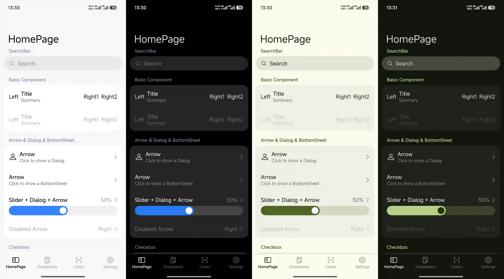
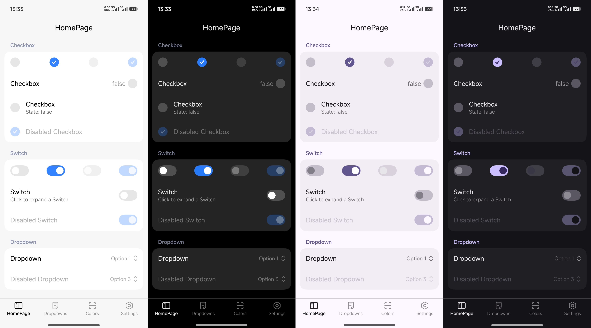
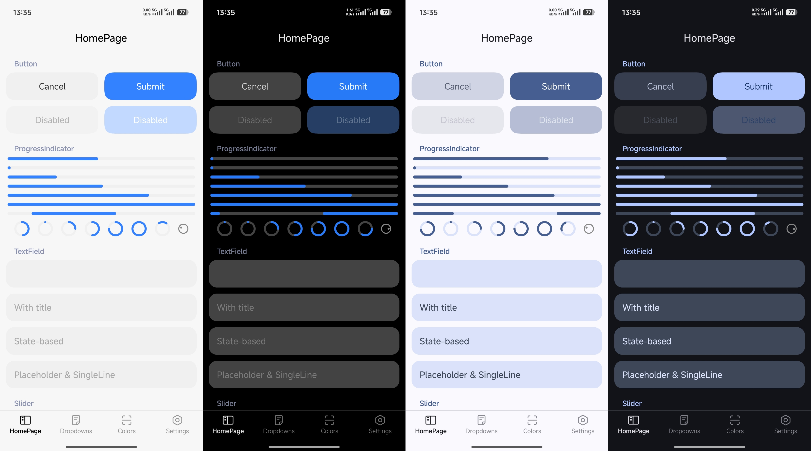
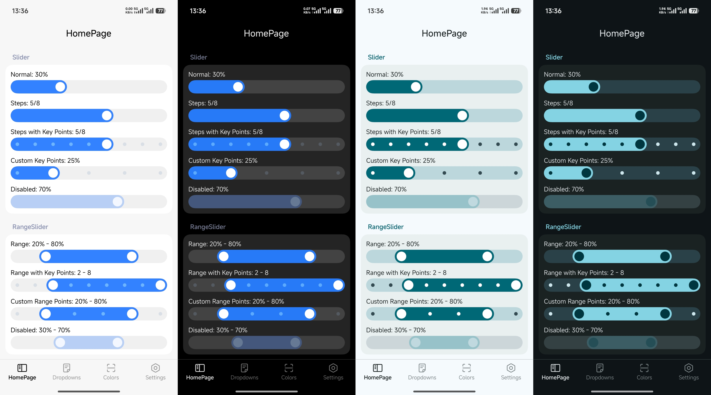
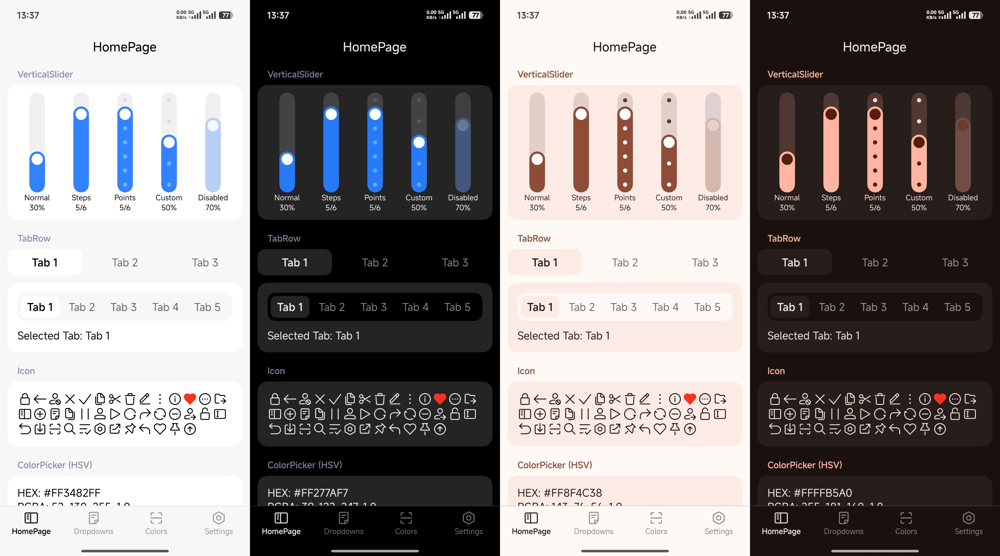
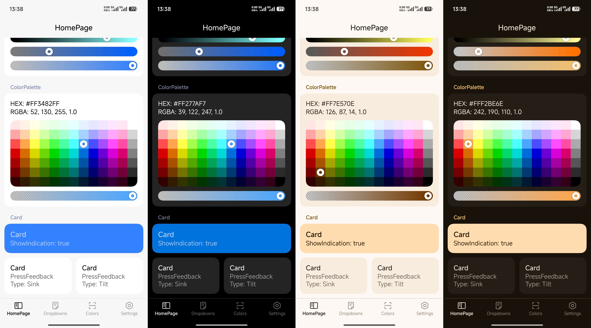

## Elyon

A UI library for Compose Multiplatform.

> This library is experimental. APIs may change without notice.

[](https://kotlinlang.org/)
[](https://kotlinlang.org/compose-multiplatform/)
[](LICENSE)

### Online Demo

[](https://vallind.github.io/elegant-ui/demo/)

### Supported Platforms


### Modules

| Module             | Description                                          |
| ------------------ | ---------------------------------------------------- |
| `elyon-ui`         | Core UI component library                            |
| `elyon-preference` | Preference components library, depends on `elyon-ui` |
| `elyon-icons`      | Extended icon library, can be used independently     |
| `elyon-blur`       | Blur effect library, can be used independently       |
| `elyon-squircle`   | Squircle shapes library, can be used independently   |
| `elyon-nav`        | Navigation library, can be used independently        |
| `elyon-shader`     | Low-level runtime shader / render effect abstraction |

### Getting Started

Elyon is not published to Maven Central yet. Add this repository as a composite build:

```kotlin
// settings.gradle.kts
includeBuild("../elyon")
```

```kotlin
// build.gradle.kts
dependencies {
    implementation(project(":elyon-ui"))
    // Optional: Add elyon-preference for preference components
    implementation(project(":elyon-preference"))
    // Optional: Add elyon-icons for more icons
    implementation(project(":elyon-icons"))
    // Optional: Add elyon-blur for blur effects
    implementation(project(":elyon-blur"))
    // Optional: Add elyon-squircle for squircle (smooth rounded corner) shapes
    implementation(project(":elyon-squircle"))
    // Optional: Add elyon-nav for navigation
    implementation(project(":elyon-nav"))
}
```

### Usage

- Provide a color scheme via `ElyonTheme(colors = ...)`, e.g., `lightColorScheme()` or `darkColorScheme()`.

```kotlin
@Composable
fun AppTheme(
    content: @Composable () -> Unit
) {
    val colors = if (isSystemInDarkTheme()) darkColorScheme() else lightColorScheme()
    return ElyonTheme(
        colors = colors,
        content = content
    )
}
```

- Use `ThemeController` to manage modes and enable Monet dynamic colors. Pass `keyColor` to set a custom seed color.

```kotlin
@Composable
fun AppTheme(
    content: @Composable () -> Unit
) {
    val controller = remember {
        ThemeController(
            ColorSchemeMode.MonetSystem,
            keyColor = Color(0xFF3482FF)
        )
    }
    return ElyonTheme(
        controller = controller,
        content = content
    )
}
```

### Screenshots

<table>
  <tr>
    <td><a href="assets/001.webp"></a></td>
    <td><a href="assets/002.webp"></a></td>
    <td><a href="assets/003.webp"></a></td>
  </tr>
  <tr>
    <td><a href="assets/004.webp"></a></td>
    <td><a href="assets/005.webp"></a></td>
    <td><a href="assets/006.webp"></a></td>
  </tr>
</table>
